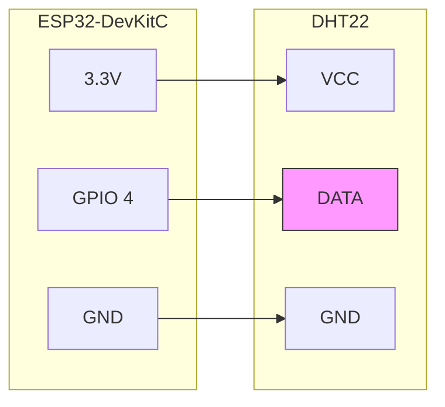
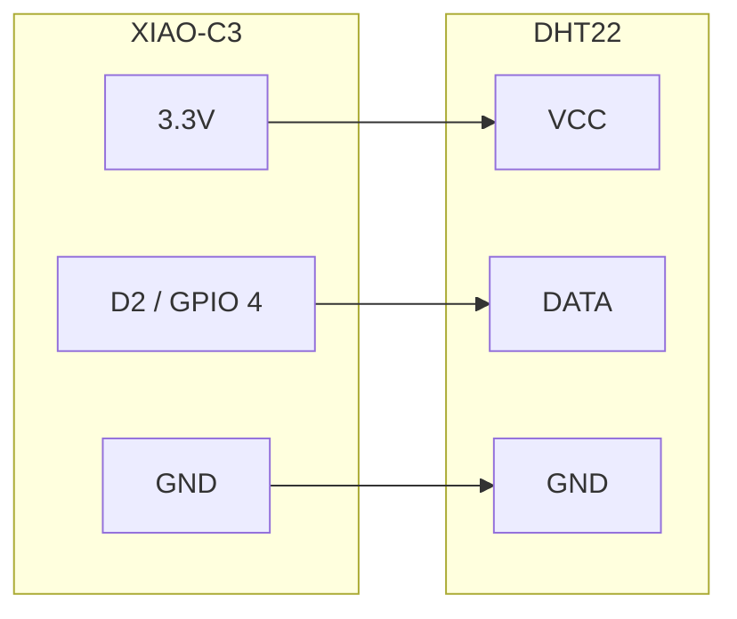
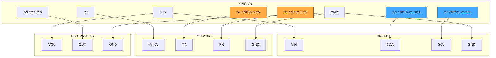

# Edge Wiring Guide — Tiered

ティア × ボードの組み合わせごとの配線図。

> 旧配線図 (`05_edge_wiring.md`) も参考として残している。

## Tier 1: ESP32-DevKitC + DHT22

**配線**:
| DHT22 ピン | ESP32 ピン | 備考 |
|-----------|-----------|------|
| VCC | 3.3V | |
| DATA | GPIO 4 | 10kΩ プルアップ抵抗 (VCC-DATA間、モジュール基板に内蔵の場合は不要) |
| GND | GND | |

## Tier 1: XIAO ESP32-C3 + DHT22

**配線**: DHT22 の DATA → XIAO D2 (GPIO 4)

## Tier 2: XIAO ESP32-C6 + BME680 + MH-Z19C + PIR

**配線表**:

| センサ | ピン | XIAO-C6 ピン | 備考 |
|--------|------|-------------|------|
| BME680 VIN | VIN | 3.3V | |
| BME680 SDA | SDA | GPIO 23 (D6) | I2C |
| BME680 SCL | SCL | GPIO 22 (D7) | I2C |
| BME680 GND | GND | GND | |
| MH-Z19C Vin | Vin | 5V | **5V 必須** (3.3V では動作しない) |
| MH-Z19C TX | TX | GPIO 0 (D0/RX) | センサTX → MCU RX |
| MH-Z19C RX | RX | GPIO 1 (D1/TX) | MCU TX → センサRX |
| MH-Z19C GND | GND | GND | |
| PIR VCC | VCC | 3.3V | AM312 の場合。HC-SR501 は 5V も可 |
| PIR OUT | OUT | GPIO 3 (D3) | デジタル出力 |
| PIR GND | GND | GND | |

### Tier 2 オプション: + BH1750

| BH1750 ピン | XIAO-C6 ピン | 備考 |
|-----------|-------------|------|
| VCC | 3.3V | |
| SDA | GPIO 23 (D6) | BME680 と I2C バス共有 |
| SCL | GPIO 22 (D7) | BME680 と I2C バス共有 |
| GND | GND | |
| ADDR | GND or N/C | GND = 0x23, VCC = 0x5C |

## Tier 2: ESP32-DevKitC + BME680 + MH-Z19C

既存の `sensor-02` と同等構成。

| センサ | ピン | ESP32 ピン | 備考 |
|--------|------|-----------|------|
| BME680 SDA | SDA | GPIO 21 | I2C |
| BME680 SCL | SCL | GPIO 22 | I2C |
| MH-Z19C TX | TX | GPIO 16 (RX1) | UART1 |
| MH-Z19C RX | RX | GPIO 17 (TX1) | UART1 |

## Tier 3: SwarmHub + Leaf 配線

Hub はセンサ直結 + ESP-NOW で Leaf と通信。物理配線は Hub ローカルセンサのみ。

### Hub (ESP32-DevKitC) ローカルセンサ

| センサ | ピン | ESP32 ピン |
|--------|------|-----------|
| SHT31 SDA | SDA | GPIO 21 |
| SHT31 SCL | SCL | GPIO 22 |
| BH1750 SDA | SDA | GPIO 21 (共有) |
| BH1750 SCL | SCL | GPIO 22 (共有) |
| PIR OUT | OUT | GPIO 13 |

### Leaf (XIAO ESP32-C6) — ESP-NOW

Leaf ノードは WiFi 不要。ESP-NOW で Hub と通信。

| センサ | ピン | XIAO-C6 ピン |
|--------|------|-------------|
| DHT22 DATA | DATA | GPIO 2 (D2) |

## 注意事項

### I2C バス共有
- 同一 I2C バスに複数デバイス接続可能（アドレスが異なれば）
- BME680 (0x77) + BH1750 (0x23) + SHT31 (0x44) は共存可能
- SHT31 と BME680 は両方温湿度を測定するので通常どちらか一方

### MH-Z19C 電源
- **5V 必須**。3.3V では正常動作しない
- XIAO-C6 の 5V ピンは USB 給電時のみ有効

### PIR 感度調整 (HC-SR501)
- 基板上の2つのポテンショメータ: 感度 / ホールド時間
- SOMS 推奨: 感度=中、ホールド時間=最短 (約3秒)

### ESP-NOW チャンネル
- Hub と全 Leaf で同じ WiFi チャンネルを使用すること
- config.json の `espnow_channel` で設定
