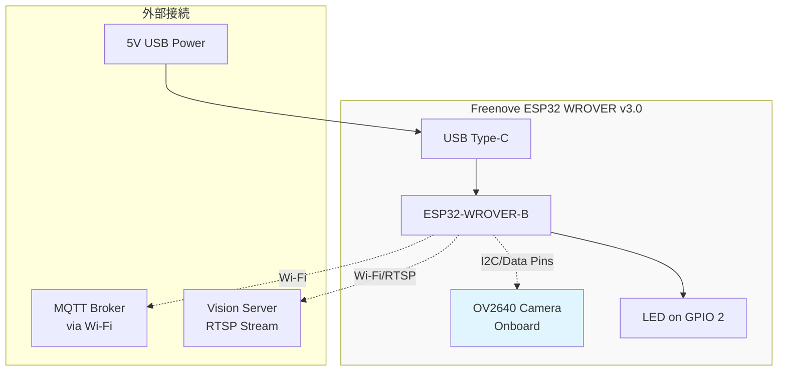
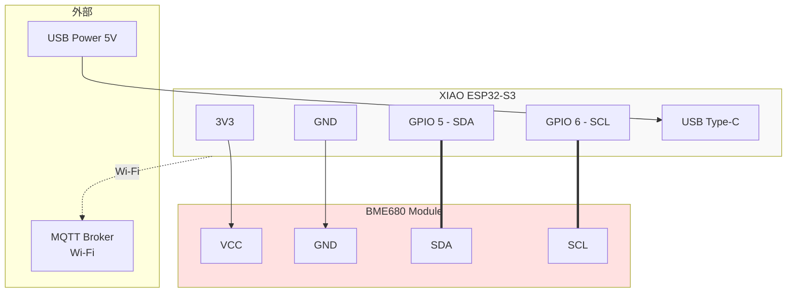

# 02. ハードウェア仕様・配線図

このドキュメントでは、テストエッジデバイスのハードウェア仕様と配線方法を説明します。

---

## 1. カメラノード: Freenove ESP32 WROVER v3.0

### 1.1 ボード仕様

| 項目 | 仕様 |
| :--- | :--- |
| **チップ** | ESP32-WROVER-B |
| **CPU** | Dual-core Xtensa LX6 @ 240MHz |
| **RAM** | 520KB SRAM + 8MB PSRAM |
| **Flash** | 4MB |
| **Wi-Fi** | 802.11 b/g/n (2.4GHz) |
| **Bluetooth** | BT 4.2 BR/EDR + BLE |
| **カメラ** | OV2640 (2MP, 最大1600x1200) |
| **電源** | USB Type-C (5V) / VIN (5-12V) |
| **GPIO** | 34個 (カメラ占有後は制限あり) |

### 1.2 OV2640カメラピン配置

Freenove ESP32 WROVER v3.0では、OV2640カメラが**基板上に実装済み**です。以下のピンがカメラ専用として占有されています。

| 機能 | GPIO Pin |
| :--- | :--- |
| **SIOD (I2C SDA)** | GPIO 26 |
| **SIOC (I2C SCL)** | GPIO 27 |
| **Y9** | GPIO 35 |
| **Y8** | GPIO 34 |
| **Y7** | GPIO 39 |
| **Y6** | GPIO 36 |
| **Y5** | GPIO 19 |
| **Y4** | GPIO 18 |
| **Y3** | GPIO 5 |
| **Y2** | GPIO 4 |
| **VSYNC** | GPIO 25 |
| **HREF** | GPIO 23 |
| **PCLK** | GPIO 22 |
| **XCLK** | GPIO 21 |
| **PWDN** | GPIO 32 |
| **RESET** | -1 (未使用) |

> **重要**: 上記ピンは他の用途に使用できません。

### 1.3 利用可能なピン (カメラ動作時)

カメラ使用時でも以下のピンは自由に使用可能：

- **GPIO 2**: LED (オンボード)
- **GPIO 12, 13, 14, 15**: 汎用I/O
- **GPIO 16, 17**: UART2 (シリアル通信)
- **GPIO 33**: アナログ入力

### 1.4 カメラノード配線図



**最小構成**: カメラノードは追加の外部配線なしで動作します（カメラがオンボード）。

---

## 2. センサーノード: XIAO ESP32-S3 + BME680

### 2.1 ボード仕様

| 項目 | 仕様 |
| :--- | :--- |
| **チップ** | ESP32-S3 (Dual-core Xtensa LX7) |
| **CPU**| @ 240MHz |
| **RAM** | 512KB SRAM + 8MB PSRAM |
| **Flash** | 8MB |
| **Wi-Fi** | 802.11 b/g/n (2.4GHz) |
| **Bluetooth** | BT 5.0 LE |
| **電源** | USB Type-C (5V) |
| **サイズ** | 21mm × 17.5mm (超小型) |
| **GPIO** | 11個 (多機能ピン) |

### 2.2 BME680センサー仕様

| 項目 | 仕様 |
| :--- | :--- |
| **測定項目** | 温度、湿度、気圧、ガス (VOC) |
| **通信** | I2C (デフォルト 0x76 or 0x77) |
| **電源** | 3.3V |
| **精度** | Temp: ±1°C, Hum: ±3%RH |

### 2.3 配線図



### 2.4 ピン配置表

| XIAO ESP32-S3 | BME680 Module | 機能 |
| :--- | :--- | :--- |
| **3V3** | VCC | 電源 (3.3V) |
| **GND** | GND | グランド |
| **GPIO 5** | SDA | I2C データ |
| **GPIO 6** | SCL | I2C クロック |

### 2.5 ブレッドボード配線例

```
XIAO ESP32-S3          BME680 Module
┌─────────┐           ┌───────────┐
│  USB-C  │           │           │
├─────────┤           │  BME680   │
│   3V3   ├───────────┤ VCC       │
│   GND   ├───────────┤ GND       │
│ GPIO 5  ├═══════════╡ SDA       │
│ GPIO 6  ├═══════════╡ SCL       │
└─────────┘           └───────────┘
     │
    USB Power
```

> **注意**: 
> - BME680は3.3V専用です。5Vを接続しないでください。
> - XIAOには内蔵プルアップ抵抗がありますが、I2C通信が不安定な場合は外部プルアップ（4.7kΩ）を追加してください。

---

## 3. 部品リスト

### 3.1 必須部品

| 部品名 | 数量 | 入手先 | 備考 |
| :--- | :--- | :--- | :--- |
| Freenove ESP32 WROVER v3.0 | 1 | Amazon JP | カメラ付き |
| XIAO ESP32-S3 | 1 | 秋月電子/Switch Science | |
| BME680 Module | 1 | 秋月電子/Switch Science | I2Cモジュール版 |
| USB Type-Cケーブル | 2 | 汎用 | データ転送対応必須 |
| ブレッドボード | 1 | 秋月電子 | 小型でOK |
| ジャンパーワイヤ (オス-オス) | 5本 | 秋月電子 | センサー接続用 |

### 3.2 オプション

| 部品名 | 用途 |
| :--- | :--- |
| ケース | デバイス保護 (3Dプリントも可) |
| 5V 2A ACアダプタ | USB電源供給 |

---

## 4. 組み立て手順

### 4.1 センサーノードの組み立て

1. **ブレッドボードにXIAO ESP32-S3を配置**
   - ピンが両サイドのレールに跨がるように配置

2. **BME680モジュールを配置**
   - XIAOの近くに配置（配線を短く）

3. **ジャンパーワイヤで接続**
   - 3V3 → VCC (赤)
   - GND → GND (黒)
   - GPIO 5 → SDA (青)
   - GPIO 6 → SCL (黄)

4. **USB Type-Cケーブルを接続**
   - PCと接続してデバイス認識を確認

### 4.2 カメラノードの準備

1. **Freenove ESP32 WROVER v3.0を箱から取り出す**
   - カメラは実装済みのため配線不要

2. **USB Type-Cケーブルを接続**
   - PCと接続してデバイス認識を確認

---

## 5. 動作確認

### 5.1 LEDテスト (カメラノード)

Freenove ESP32 WROVER v3.0には、GPIO 2にオンボードLEDがあります。

```cpp
void setup() {
  pinMode(2, OUTPUT);
}

void loop() {
  digitalWrite(2, HIGH);
  delay(500);
  digitalWrite(2, LOW);
  delay(500);
}
```

### 5.2 I2Cスキャン (センサーノード)

BME680が正しく接続されているか確認：

```cpp
#include <Wire.h>

void setup() {
  Serial.begin(115200);
  Wire.begin(5, 6); // SDA=5, SCL=6
  
  Serial.println("I2C Scanner");
  byte count = 0;
  
  for (byte i = 1; i < 127; i++) {
    Wire.beginTransmission(i);
    if (Wire.endTransmission() == 0) {
      Serial.print("Found device at 0x");
      Serial.println(i, HEX);
      count++;
    }
  }
  Serial.printf("Found %d device(s)\n", count);
}

void loop() {}
```

**期待される出力**: `Found device at 0x76` または `0x77`

---

## 6. 次のステップ

ハードウェアの準備が完了したら、[03_firmware_flashing.md](03_firmware_flashing.md) でファームウェアのビルドと書き込みを行ってください。
